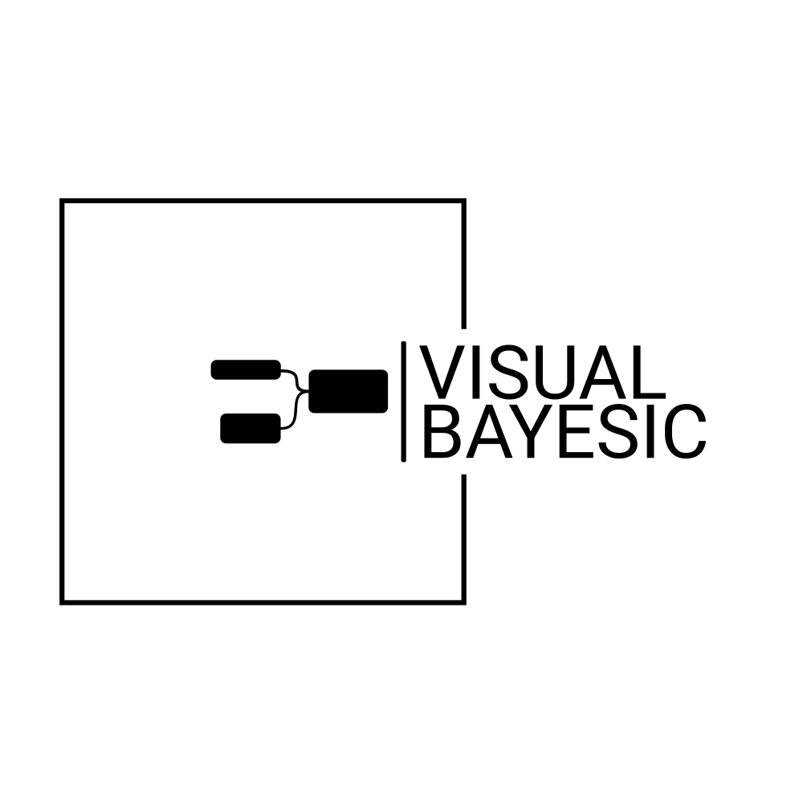

# 

> Visual Bayesic: Visual Scripting for Bayesian Inference

Visual Bayesic
==============

Welcome to Visual Bayesic, the forefront of Bayesian inversion through visual scripting! 

If you are looking to harness the power of Bayesian inference, Visual Bayesic offers an intuitive graphical interface paired with robust Python functionalities, making the entire process seamless and user-friendly.

Documentation (Work in Progress)
--------------------------------

**Please Note:** ``Visual Bayesic`` is still in its development phase, and features are continuously evolving.

Explore our early documentation here:

Key resources:
- [Developers Guide](https://gempy-project.github.io/visual-bayesic-xircuits/)

